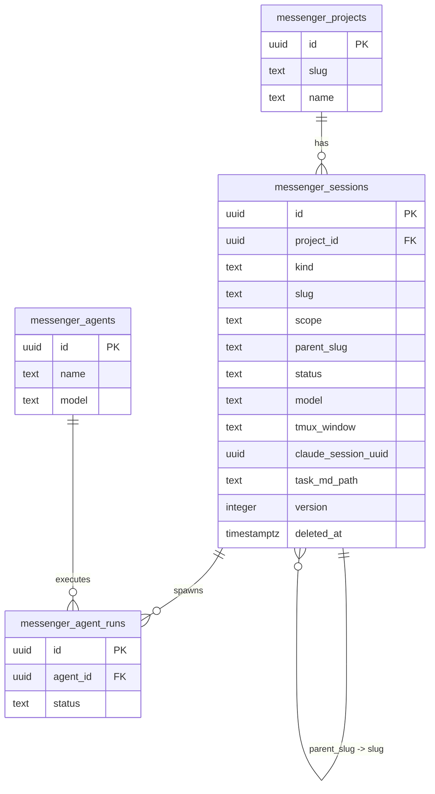
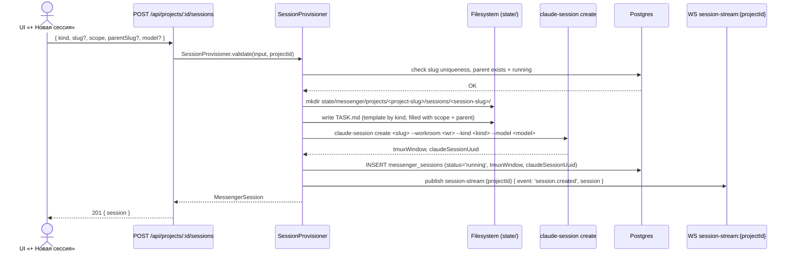
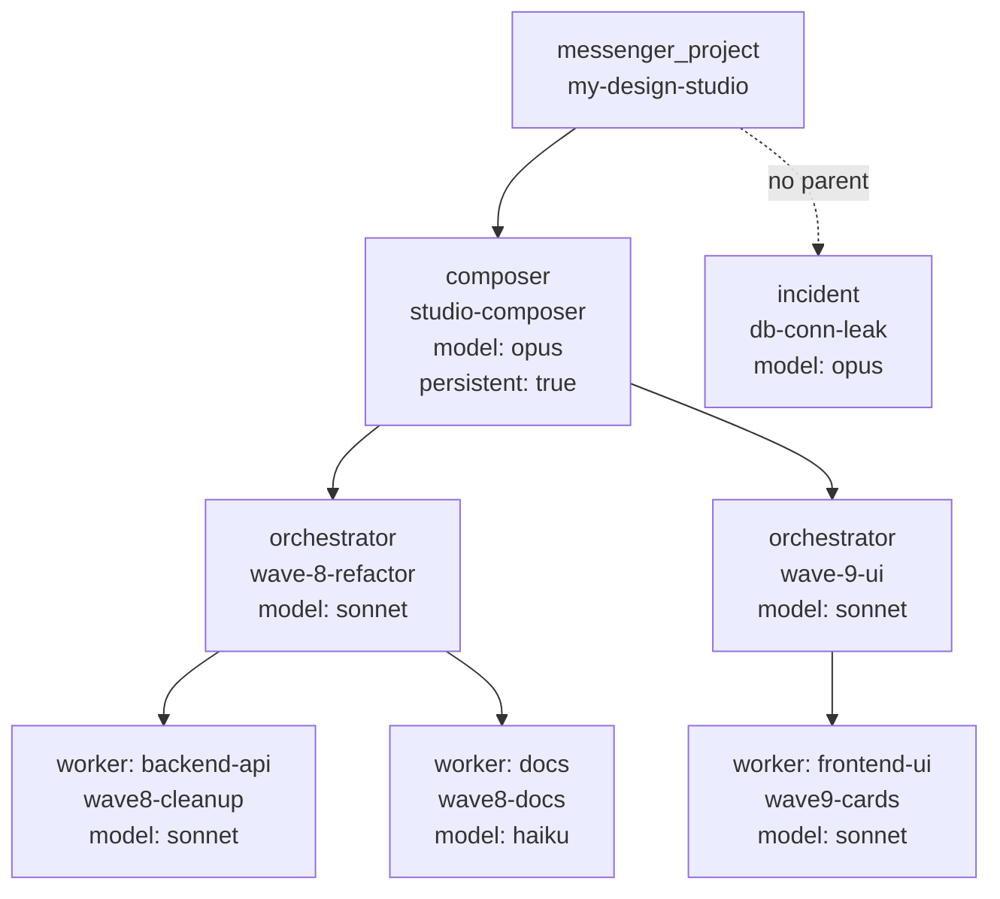

# 27. Session Provisioning — автоматическое создание сессий из карточки проекта

Date: 2026-04-29
Scope: W1 wave «Project-Centric Messenger» — превращение ручного `mkdir + vim TASK.md + claude-session create` в кнопку «+ Новая сессия» с выбором kind (composer / orchestrator / worker / incident). Спека описывает модель данных, API контракт, шаблоны TASK.md, lifecycle провижионера, иерархию parent→child, scope validation, storage layout и связь с существующими подсистемами.

See also: [§21 Agent Orchestration](./21-agent-orchestration.md) · [§22 Skill Bundles](./22-skill-bundles.md) · [§23 Project-Centric Messenger](./23-project-centric-messenger.md)

---

## 1. Motivation

Сейчас создание Claude-сессии — полностью ручной процесс:

```bash
mkdir -p ~/state/messenger/projects/my-project/sessions/my-worker
vim ~/state/messenger/projects/my-project/sessions/my-worker/TASK.md
claude-session create my-worker --workroom w3 --model sonnet --prompt "..."
```

Это:
- медленно (5–10 мин на сессию),
- error-prone (slug collisions, wrong parent, wrong model),
- не отражается в Postgres → никаких live-updates в UI.

**Цель**: кнопка «+ Новая сессия» в карточке проекта порождает сессию в один клик, автоматически создаёт TASK.md по шаблону и запускает `claude-session create`. Все сессии видны в Postgres и в real-time в UI через WS.

---

## 2. Модель данных

Новая таблица `messenger_sessions`. OCC через `version`, soft-delete через `deleted_at` — по правилам v5.

```ts
messengerSessions = pgTable('messenger_sessions', {
  id:               uuid('id').primaryKey().defaultRandom(),
  projectId:        uuid('project_id').notNull()
                      .references(() => messengerProjects.id, { onDelete: 'cascade' }),
  kind:             text('kind').notNull(),     // 'composer' | 'orchestrator' | 'worker' | 'incident'
  slug:             text('slug').notNull(),     // [a-z0-9-]+, ≤31 chars, unique per project
  scope:            text('scope').notNull(),    // short description of what this session does
  parentSlug:       text('parent_slug'),        // FK → messenger_sessions.slug (same project)
  status:           text('status').notNull()
                      .default('pending'),      // 'pending' | 'running' | 'done' | 'failed' | 'archived'
  model:            text('model').notNull(),    // 'opus' | 'sonnet' | 'haiku'
  tmuxWindow:       text('tmux_window'),        // tmux window identifier after spawn
  claudeSessionUuid: uuid('claude_session_uuid'), // assigned by claude-session create
  taskMdPath:       text('task_md_path').notNull(), // absolute path to TASK.md on server
  createdAt:        tstz('created_at').defaultNow().notNull(),
  updatedAt:        tstz('updated_at').defaultNow().notNull(),
  version:          integer('version').default(1).notNull(),
  deletedAt:        tstz('deleted_at'),
}, (t) => [
  unique('messenger_sessions_project_slug_unique')
    .on(t.projectId, t.slug)
    .where(sql`deleted_at is null`),
  index('messenger_sessions_project_idx').on(t.projectId),
  index('messenger_sessions_parent_idx').on(t.projectId, t.parentSlug),
  index('messenger_sessions_status_idx').on(t.status),
])
```

### 2.1 Entity relationship diagram



### 2.2 Kind defaults (из `skill-bundles.json`)

| kind | default model | maxParallel | persistent |
|---|---|---|---|
| `composer` | `opus` | 1 per project | `true` |
| `orchestrator` | `sonnet` | 2 per composer | `false` |
| `worker` | `sonnet` | per sub-kind | `false` |
| `incident` | `opus` | 1 global | `false` |

`model` в таблице — override; если не задан при создании, берётся из kind-defaults.

---

## 3. API контракт

Базовый путь: `server/api/projects/[id]/sessions/`

### 3.1 `POST /api/projects/:id/sessions`

**Body:**

```ts
{
  kind: 'composer' | 'orchestrator' | 'worker' | 'incident'
  slug?: string          // auto-generated if omitted: `${kind}-${nanoid(6)}`
  scope: string          // required, 1–500 chars
  parentSlug?: string    // required for orchestrator and worker
  model?: 'opus' | 'sonnet' | 'haiku'   // overrides kind default
}
```

**Response 201:**

```ts
{ session: MessengerSession }
```

**Validation rules:**

| Condition | Error code | Status |
|---|---|---|
| slug already taken in project | `SESSION_SLUG_TAKEN` | 409 |
| orchestrator without parentSlug | `PARENT_KIND_INVALID` | 400 |
| worker without parentSlug | `PARENT_KIND_INVALID` | 400 |
| parent not found | `PARENT_NOT_FOUND` | 404 |
| parent.kind incompatible | `PARENT_KIND_INVALID` | 400 |
| parent.status ≠ 'running' | `PARENT_NOT_RUNNING` | 409 |
| slug regex mismatch (`[a-z0-9-]+`, >31 chars) | `SLUG_INVALID` | 400 |
| kind not in skill-bundles.json | `KIND_UNKNOWN` | 400 |
| composer already exists in project (maxParallel=1) | `MAX_PARALLEL_EXCEEDED` | 409 |

**Parent compatibility matrix:**

| child.kind | allowed parent.kind |
|---|---|
| `orchestrator` | `composer` |
| `worker` | `composer`, `orchestrator` |
| `composer` | — (no parent) |
| `incident` | — (no parent) |

### 3.2 `GET /api/projects/:id/sessions`

**Query params:**

```
?status=running&kind=worker&parentSlug=my-composer
```

All params optional. Returns full tree if no filters.

**Response 200:**

```ts
{ sessions: MessengerSession[] }
```

Sessions returned flat; client builds tree via `parentSlug` links.

### 3.3 `PATCH /api/projects/:id/sessions/:slug`

**Body (partial):**

```ts
{
  status?: 'pending' | 'running' | 'done' | 'failed' | 'archived'
  scope?: string
}
```

`slug`, `kind`, `parentSlug`, `projectId` — immutable after creation.

Status transitions allowed:

```
pending  → running | failed | archived
running  → done | failed | archived
done     → archived
failed   → archived
archived → (terminal)
```

Cascade on archive: archiving a `composer` or `orchestrator` triggers cascade archive of all active child sessions (returns 200 with `cascadeArchived: string[]` in body).

**Response 200:**

```ts
{ session: MessengerSession, cascadeArchived?: string[] }
```

### 3.4 `DELETE /api/projects/:id/sessions/:slug`

Soft delete: sets `deleted_at = now()`, `status = 'archived'`, cascades to children.

**Response 204** (no body).

---

## 4. Zod validation schema

```ts
// shared/types/messenger-session.ts

export const SessionKindSchema = z.enum(['composer', 'orchestrator', 'worker', 'incident'])
export type SessionKind = z.infer<typeof SessionKindSchema>

export const SessionModelSchema = z.enum(['opus', 'sonnet', 'haiku'])
export const SessionStatusSchema = z.enum(['pending', 'running', 'done', 'failed', 'archived'])

export const SessionSlugSchema = z
  .string()
  .min(1)
  .max(31)
  .regex(/^[a-z0-9-]+$/, 'slug must match [a-z0-9-]+')

export const CreateSessionInputSchema = z.object({
  kind: SessionKindSchema,
  slug: SessionSlugSchema.optional(),
  scope: z.string().min(1).max(500),
  parentSlug: SessionSlugSchema.optional(),
  model: SessionModelSchema.optional(),
})
export type CreateSessionInput = z.infer<typeof CreateSessionInputSchema>

export const PatchSessionInputSchema = z.object({
  status: SessionStatusSchema.optional(),
  scope: z.string().min(1).max(500).optional(),
}).refine((v) => v.status !== undefined || v.scope !== undefined, {
  message: 'at least one field required',
})
```

---

## 5. Шаблоны TASK.md по kind

Все шаблоны — реальные пастабельные блоки. Значения в `<angle-brackets>` заменяются провижионером или оператором.

### 5.1 Composer

```markdown
---
kind: composer
model: opus
persistent: true
project: <project-slug>
created_at: <ISO-8601>
---

# Composer: <project-name>

## Strategic role

You are the persistent composer for project **<project-name>**.
Your responsibilities:
- Maintain project context and goals across the full lifecycle.
- Decompose incoming work into orchestrator tasks using the TASK | SCOPE | EFFORT | CONTEXT format.
- Spawn orchestrators via `claude-session create <slug> --kind orchestrator --parent <your-slug>`.
- Review completed work, update project state, decide next priorities.

## Active orchestrators

<!-- replace-with-real-values: list current orchestrator slugs -->

## Project context

<scope>
```

### 5.2 Orchestrator

```markdown
---
kind: orchestrator
model: sonnet
parent: <composer-slug>
project: <project-slug>
created_at: <ISO-8601>
---

# Orchestrator: <slug>

## Delegated by composer

Received from `<composer-slug>`:

| TASK | SCOPE | EFFORT | CONTEXT |
|---|---|---|---|
| <task-name> | <scope> | <S/M/L/XL> | <relevant-files-or-adr> |

## Decomposition protocol

1. Read CLAUDE.md and relevant architecture docs.
2. Break the task into worker units (each ≤ 1 logical change, ≤ 4h effort).
3. Spawn workers: `claude-session create <worker-slug> --kind <worker-kind> --parent <your-slug>`.
4. Monitor worker status; collect results; report to composer.

## Active workers

<!-- replace-with-real-values: list spawned worker slugs -->

## Scope

<scope>
```

### 5.3 Worker

```markdown
---
kind: <frontend-ui|backend-api|db-migration|docs|refactor|tests>
model: sonnet
parent: <orchestrator-slug>
project: <project-slug>
base_branch: <git-branch>
created_at: <ISO-8601>
---

# Worker: <slug>

## Scope

<scope>

## Acceptance criteria

<!-- replace-with-real-values -->
- [ ] <criterion-1>
- [ ] <criterion-2>

## Out of scope

<!-- replace-with-real-values -->

## Context

Relevant files: <!-- replace-with-real-values -->
Related ADRs: <!-- replace-with-real-values -->
```

### 5.4 Incident

```markdown
---
kind: incident
model: opus
priority: high
project: <project-slug>
created_at: <ISO-8601>
---

# Incident: <slug>

## Symptoms

<describe what is broken, observed at <timestamp>>

## Hypotheses

1. <!-- replace-with-real-values -->
2. <!-- replace-with-real-values -->

## Acceptance (incident resolved when)

- [ ] Root cause identified and documented.
- [ ] Fix deployed or rollback confirmed.
- [ ] Post-mortem note added to `docs/architecture-v5/14-refactor-roadmap.md`.

## Timeline

<!-- replace-with-real-values: add entries as investigation proceeds -->
```

---

## 6. Lifecycle провижионера



**Шаги провижионера подробнее:**

1. **validate** — `SessionProvisioner.validate()` проверяет все инварианты (§4 Zod + бизнес-правила §3.1) перед любой side-effect-операцией.
2. **mkdir** — создаёт `state/messenger/projects/<project-slug>/sessions/<session-slug>/` и `logs/` внутри. **Это новая convention** — в текущем коде такой структуры нет (см. §7).
3. **write TASK.md** — заполняет шаблон (§5) данными из payload (scope, parentSlug, model, created_at).
4. **spawn** — вызывает `~/bin/claude-session create <slug> --workroom <wr> --kind <kind> --model <model> --prompt "$(head -1 TASK.md)"`. Возвращает tmuxWindow и claudeSessionUuid.
5. **INSERT** — атомарный INSERT в `messenger_sessions`; status='running' сразу (не pending), потому что claude-session create синхронно возвращает PID.
6. **publish** — публикует событие в Redis Pub/Sub канал `session-stream:{projectId}`, который доставляется всем подписанным WS-клиентам.

**Rollback при ошибке:** если spawn или INSERT падают — удалить созданный каталог и файл (cleanup в `finally`-блоке провижионера).

---

## 7. Иерархия parent → child



**Правила иерархии:**

- **Composer** — ровно 1 на проект (maxParallel=1). Persistent: не завершается пока проект активен. Допускается >1 только с явно разными scope (тогда maxParallel увеличивается в `skill-bundles.json`).
- **Orchestrator** — под composer, max 2 параллельно (из `skill-bundles.json#orchestrator.maxParallel`). Не persistent — завершается после выполнения своей задачи.
- **Worker** — под orchestrator (или под composer напрямую — direct dispatch), maxParallel определяется по sub-kind в `skill-bundles.json`.
- **Incident** — отдельная ветка без parent, max 1 активный на проект.

**Каскад статусов:**

При `PATCH .../sessions/<composer-slug>` с `{ status: 'archived' }`:
1. Все дочерние orchestrators (status∈{pending,running}) → `archived`.
2. Все дочерние workers (рекурсивно) → `archived`.
3. Incident — НЕ каскадируется (независимая ветка).
4. UI показывает confirmation dialog с числом затронутых сессий перед отправкой запроса.

---

## 8. Storage layout

**Выбранная структура: иерархическая** (вложенные директории).

```
state/messenger/projects/<project-slug>/          # НОВАЯ CONVENTION
  sessions/
    <composer-slug>/
      TASK.md
      logs/
        claude.log
        stream.jsonl
      <orchestrator-slug>/
        TASK.md
        logs/
        <worker-slug>/
          TASK.md
          logs/
    <incident-slug>/
      TASK.md
      logs/
```

**Почему иерархическая, а не flat:**

| Критерий | Иерархическая | Flat (`sessions/<slug>/`) |
|---|---|---|
| Визуальная связь parent→child | ✅ очевидна из дерева FS | ❌ только через имена файлов |
| `ls sessions/` читаемость | ✅ видны только composers | ✅ все сессии |
| rmdir каскад | ✅ `rm -rf <composer>/` | ❌ нужно фильтровать по slug-prefix |
| Deep nesting (>3 уровня) | ⚠️ может быть неудобно | ✅ плоско всегда |
| Symlinks для cross-reference | не нужны | не нужны |

Для v5.3 (max 3 уровня: composer → orchestrator → worker) иерархическая структура предпочтительна. Если в будущем появятся worker→subworker (4+ уровня) — пересмотреть в пользу flat.

**Путь до TASK.md** сохраняется в `messenger_sessions.task_md_path` как абсолютный путь, например:

```
/home/claudecode/state/messenger/projects/my-design-studio/sessions/studio-composer/wave-8-refactor/wave8-cleanup/TASK.md
```

---

## 9. Связь с существующими подсистемами

### 9.1 `messenger_agents` (existing)

- **Агент** = роль (static definition: name, model, ingestToken, config).
- **Сессия** = исполнение роли для конкретного проекта.
- Связь: many-to-one. Один агент (role="orchestrator") может иметь много прошедших сессий, одну активную на проект.
- В `messenger_sessions.claude_session_uuid` хранится идентификатор, возвращённый `claude-session create` — он же пишется в `messenger_agent_runs.id` при первом событии.

### 9.2 `messenger_agent_runs` (existing)

- Каждая сессия → ≥1 agent_run (обычно ровно один за время жизни сессии).
- Runs создаются автоматически при первом событии из `claude-stream-bridge`.
- `messenger_sessions` → `messenger_agent_runs`: one-to-many через `claude_session_uuid`.

### 9.3 `~/state/queue/` (orchestrator file-queue)

Сейчас оркестратор пишет задачи воркерам через файловую очередь `~/state/queue/<slug>.task`. С появлением сессионного провижионера возможны два режима:

| Режим | Описание |
|---|---|
| **file-queued** | Orchestrator пишет task в `~/state/queue/`, `claude-queue-daemon` спавнит воркера. Старый флоу, без Postgres. |
| **UI-spawned** | Пользователь нажимает «+ Новая сессия» в карточке проекта → `POST /api/projects/:id/sessions` → провижионер создаёт TASK.md и запускает воркера. Новый флоу, с Postgres. |

**Совместное существование:** оба режима используют один `claude-session create`, поэтому созданные сессии видны в `claude-session list`. Для синхронизации с Postgres `claude-queue-daemon` должен вызывать `POST /api/projects/:id/sessions` вместо прямого вызова `claude-session create` — это задача W2.

### 9.4 WS канал `session-stream:{projectId}`

- Протокол: Redis Pub/Sub → WS, аналогично `agent-stream:{agentId}` из §21.
- События: `session.created`, `session.status_changed`, `session.archived`.
- Тикет-авторизация: стандартная `ws_ticket:<token>` с 30s TTL (§05.5.9).
- UI карточки проекта подписывается на канал при открытии и отписывается при закрытии.

---

## 10. Open questions

1. **Deduplication policy для совпадающих scope.** Что делать если `POST` приходит с scope, идентичным существующей running-сессии? Сейчас: разрешить (пользователь может ошибиться — пусть увидит дубликат и сам удалит). Альтернатива: warn + 409 `SCOPE_DUPLICATE`.

2. **Canonical store: Postgres vs filesystem.** Сейчас `task_md_path` живёт в Postgres, а сам файл — на FS. При рассинхронизации (FS удалён вручную, Postgres запись осталась) — неконсистентность. Нужна ли периодическая reconciliation task?

3. **Retention policy архивных сессий.** Archived sessions остаются в Postgres и на FS бессрочно. Нужно ли TTL (напр. 90 дней) и автоматическая чистка?

4. **claude-session create — синхронный или асинхронный?** Сейчас спека предполагает синхронный spawn (tmuxWindow возвращается сразу). Если claude-session create станет асинхронным (через queue), статус сессии при создании должен быть `pending` → `running` после подтверждения.

5. **maxParallel enforcement.** Сейчас maxParallel читается из `skill-bundles.json` на сервере. Если файл изменился между проверкой и INSERT — race condition. Нужна ли advisory lock или DB constraint?

6. **Direct dispatch: worker под composer.** Спека допускает `worker.parentSlug = composer-slug`, минуя orchestrator. Нужно ли это явно запретить в будущем (чтобы не смешивать уровни), или оставить для hotfix-сценариев?

---

## Реализация (волны)

| Волна | Содержание |
|---|---|
| **W1** (текущая) | Эта спека. |
| **W2** | Drizzle schema `messenger_sessions`, `server/modules/sessions/SessionProvisioner`, интеграция `claude-queue-daemon`. |
| **W3** | UI-кнопка «+ Новая сессия» в карточке проекта (`messenger/web`). |
| **W4** | WS streaming `session-stream:{projectId}`, runtime-реестр иерархий. |
| **W5** | Stop / restart / archive из UI, cascade confirmation dialog. |
