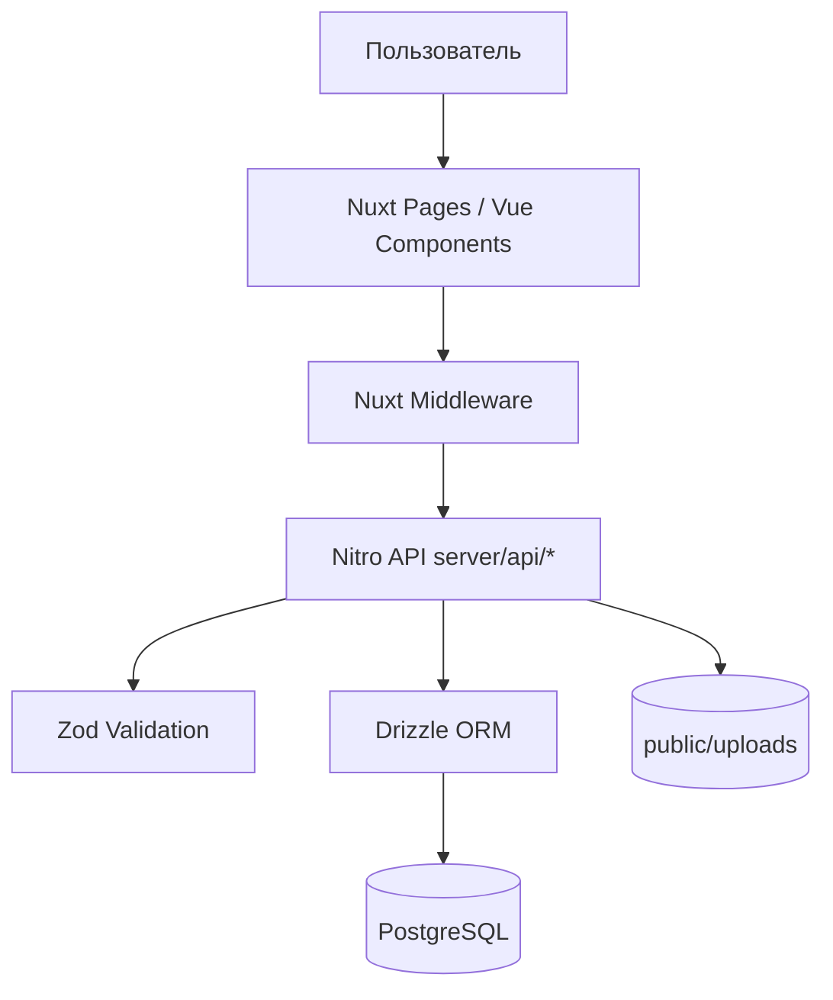

# Архитектура программного стека

## 1) Общая картина

Проект построен как **full-stack Nuxt 3** приложение:

- `app/*` — клиентский UI (Vue 3 + Nuxt Pages/Layout + Pinia),
- `server/api/*` — backend-эндпоинты на Nitro/H3,
- `server/db/*` — доступ к Postgres через Drizzle ORM,
- `server/utils/*` — инфраструктурная логика (в т.ч. управление шаблонами roadmap),
- `shared/types/*` — общие типы/схемы для серверной и клиентской частей.

Таким образом, фронтенд и backend живут в одном репозитории и разворачиваются как единое приложение.

## 2) Технологии и их роли

### UI / Frontend

- **Nuxt 3** (`nuxt`) — SSR/SPA-платформа, маршрутизация через файловую структуру.
- **Vue 3** — компонентная модель интерфейса.
- **@nuxt/ui** — UI-библиотека компонентов.
- **Tailwind CSS v4** — утилитарные стили.
- **Pinia + @pinia/nuxt** — состояние клиента (например, сессия/роль в `app/stores/auth.ts`).

### Backend / API

- **Nitro + H3** — обработчики `server/api/**/*.ts`.
- **Zod** — валидация входящих payload (`readValidatedNodeBody`).
- **bcryptjs** — проверка/хеширование паролей администратора.

### Данные и инфраструктура

- **PostgreSQL** — основное хранилище бизнес-данных.
- **drizzle-orm + drizzle-kit** — схема, запросы, миграции.
- **Redis (ioredis)** — подготовлен в конфиге (`redisUrl`), как инфраструктурный сервис.
- **Локальное файловое хранилище** (`public/uploads`) — загружаемые файлы.
- **JSON-хранилище кастомных шаблонов** (`server/data/roadmap-templates.custom.json`) — пользовательские сценарии roadmap.

## 3) Конфигурация приложения

### Nuxt (`nuxt.config.ts`)

- Включены модули: `@nuxt/ui`, `@pinia/nuxt`.
- `runtimeConfig`:
  - приватные переменные: `databaseUrl`, `redisUrl`, `sessionSecret`,
  - публичные: `public.appName`.
- В `nitro.alias` настроены алиасы для доступа к `server` и `shared` из server-кода.

### Drizzle (`drizzle.config.ts`)

- Диалект: `postgresql`.
- Схема: `server/db/schema.ts`.
- Миграции: `server/db/migrations`.

## 4) Схема слоёв

## 5) Скрипты жизненного цикла

Из `package.json`:

- `pnpm dev` — запуск разработки (`nuxt dev --port 3000`),
- `pnpm build` / `pnpm preview` / `pnpm start` — production-цикл,
- `pnpm db:generate` / `db:migrate` / `db:push` / `db:studio` — обслуживание БД,
- `pnpm migrate:json` — перенос данных из JSON в Postgres.

## 6) Принципы архитектуры стека

1. **Monorepo-подход в рамках Nuxt**: UI + API + data access в едином коде.
2. **Role-based доступ**: маршруты и API разграничиваются по ролям (admin/client/contractor).
3. **Schema-first для данных**: таблицы и связи описаны в Drizzle-схеме.
4. **Минимизация внешней сложности**: загрузки файлов хранятся локально в `public/uploads`.
5. **Сценарный bootstrap проекта**: структура нового проекта и стартовый roadmap формируются сервером из выбранного шаблона.
