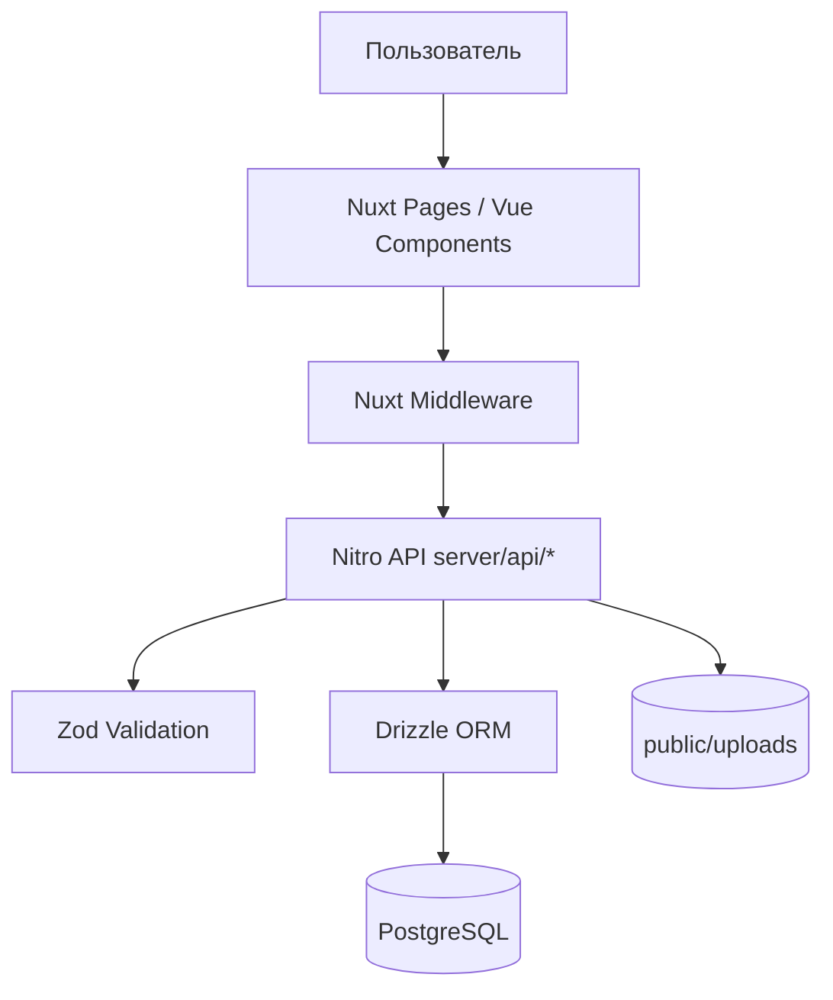

# Архитектура программного стека

> Актуализировано: 2026-03-03. Основной справочник → [ARCHITECTURE.md](../ARCHITECTURE.md)

## 1) Общая картина

Проект построен как **full-stack Nuxt 4** приложение:

- `app/*` — клиентский UI (Vue 3 Composition API + Nuxt Pages/Layouts + composables через `useState`),
- `server/api/*` — 95 backend-эндпоинтов на Nitro/H3,
- `server/db/*` — доступ к PostgreSQL 16 через Drizzle ORM (19 таблиц),
- `server/middleware/*` — 4 серверных middleware (CSP, rate-limit, body-size-limit, CSRF),
- `server/utils/*` — HMAC-авторизация, загрузка файлов, управление шаблонами roadmap,
- `shared/types/*` — 12 файлов общих типов/Zod-схем для серверной и клиентской частей,
- `shared/utils/*` — 2 файла утилит (roadmap, work-status) — единый источник истины для статусов.

Фронтенд и backend живут в одном репозитории и разворачиваются как единое приложение.

## 2) Технологии и их роли

### UI / Frontend

- **Nuxt 4.3.x** — SSR/SPA-платформа, маршрутизация через файловую структуру.
- **Vue 3** (Composition API) — 60 компонентов + 19 страниц.
- **@nuxt/ui 3** — UI-библиотека компонентов.
- **Tailwind CSS 4** — утилитарные стили + glassmorphism-система (2 055 строк `main.css`).
- **Pinia** — подключён через `@pinia/nuxt`, но состояние управляется преимущественно через `useState()` в composables.

### Backend / API

- **Nitro + H3** — 95 обработчиков в `server/api/**/*.ts`.
- **Zod** — валидация входящих payload (`readValidatedNodeBody`).
- **bcryptjs** — хеширование паролей.
- **HMAC SHA-256** — подписанные cookie-сессии (admin, client, contractor), 30 дней.
- **Серверные middleware** — CSP, rate-limit, body-size-limit, CSRF (double-submit cookie).
- **Серверные плагины** — CSP nonce, error-sanitizer.

### Данные и инфраструктура

- **PostgreSQL 16** (Docker, порт 5433) — 19 таблиц бизнес-данных.
- **drizzle-orm 0.41.x + drizzle-kit** — схема, запросы, миграции.
- **Redis 7** (Docker, порт 6380) — инфраструктурный сервис.
- **Локальное файловое хранилище** (`public/uploads`) — загружаемые файлы (валидация MIME + magic bytes, лимит 20 МБ).
- **JSON-хранилище кастомных шаблонов** (`server/data/roadmap-templates.custom.json`) — пользовательские сценарии roadmap.

## 3) Конфигурация приложения

### Nuxt (`nuxt.config.ts`)

- Включены модули: `@nuxt/ui`, `@pinia/nuxt`.
- `runtimeConfig`:
  - приватные переменные: `databaseUrl`, `redisUrl`, `sessionSecret`,
  - публичные: `public.appName`.
- В `nitro.alias` настроены алиасы для доступа к `server` и `shared` из server-кода.

### Drizzle (`drizzle.config.ts`)

- Диалект: `postgresql`.
- Схема: `server/db/schema.ts`.
- Миграции: `server/db/migrations`.

## 4) Схема слоёв

```mermaid
flowchart TD
  U[Пользователь] --> V[Nuxt Pages / Vue Components]
  V --> M[Nuxt Middleware]
  M --> A[Nitro API server/api/*]
  A --> Z[Zod Validation]
  A --> D[Drizzle ORM]
  D --> P[(PostgreSQL)]
  A --> F[(public/uploads)]
```

## 5) Скрипты жизненного цикла

Из `package.json`:

- `pnpm dev` — запуск разработки (`nuxt dev --port 3000`),
- `pnpm build` / `pnpm preview` / `pnpm start` — production-цикл,
- `pnpm db:generate` / `db:migrate` / `db:push` / `db:studio` — обслуживание БД,
- `pnpm migrate:json` — перенос данных из JSON в Postgres.

## 6) Принципы архитектуры стека

1. **Monorepo-подход в рамках Nuxt**: UI + API + data access в едином коде.
2. **Role-based доступ**: маршруты и API разграничиваются по ролям (admin/client/contractor).
3. **Schema-first для данных**: таблицы и связи описаны в Drizzle-схеме.
4. **Минимизация внешней сложности**: загрузки файлов хранятся локально в `public/uploads`.
5. **Сценарный bootstrap проекта**: структура нового проекта и стартовый roadmap формируются сервером из выбранного шаблона.
