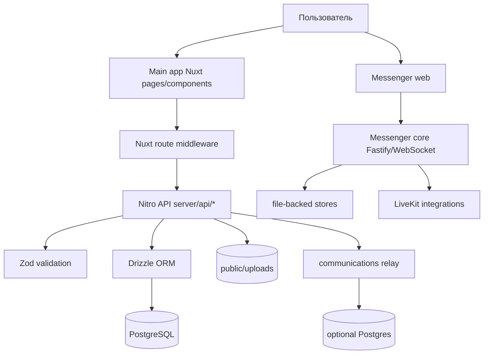

# Архитектура программного стека

> Актуализировано: 2026-03-03. Основной справочник → [ARCHITECTURE.md](../ARCHITECTURE.md)

## 1) Общая картина

Репозиторий построен как **multi-contour monorepo** с несколькими runtime-контурами:

- `app/*` + `server/*` + `shared/*` — основная full-stack Nuxt 4 платформа,
- `app/pages/chat/*` + `server/api/chat/*` — встроенный communications/chat контур внутри main app,
- `messenger/web` + `messenger/core` — отдельный standalone messenger,
- `services/communications-service` — отдельный relay/signaling сервис.

Главное правило: это один репозиторий, но не одно runtime-приложение. Основная платформа, standalone messenger и relay service развиваются и деплоятся как разные контуры.

## 2) Технологии и их роли

### UI / Frontend

- **Main app: Nuxt 4.3.x + Vue 3 + @nuxt/ui 3** — SSR/SPA-платформа основной CRM/ERP части.
- **Messenger web: Nuxt 4 + Vuetify 4 + MDI** — client-only shell standalone messenger.
- **Tailwind CSS 4** — utility/design infrastructure основной платформы.
- **Main app state** — composables + `useState()`.
- **Pinia** — подключён, но в основной платформе не является state layer по умолчанию; в messenger/web может использоваться адресно.

### Backend / API

- **Nitro + H3** — backend основной платформы в `server/api/**/*.ts`.
- **Fastify 5 + WebSocket** — realtime backend standalone messenger в `messenger/core`.
- **Node.js relay service** — encrypted room/signaling сервис в `services/communications-service`.
- **Zod** — валидация payload/schema на server-side runtime-ах.
- **bcryptjs / HMAC SHA-256** — auth/session слой основной платформы.
- **Серверные middleware и Nitro plugins** — security headers, CSP, CSRF, rate limit и request lifecycle только для main app Nitro-контура.

### Данные и инфраструктура

- **PostgreSQL 16** — основная БД main app; communications service может использовать отдельный Postgres URL для durable storage.
- **drizzle-orm 0.41.x + drizzle-kit** — schema/query/migration слой основной платформы.
- **Redis 7** — инфраструктурный сервис основной платформы.
- **Локальное файловое хранилище** (`public/uploads`) — файлы основной платформы.
- **File-backed store modules** — persistence baseline в `messenger/core`.
- **Shared contracts + project data bootstrap** — phase/project-control сценарии основной платформы собираются из shared contracts и серверной инициализации проекта, без отдельного JSON-хранилища шаблонов фаз.

## 3) Конфигурация приложения

### Main app Nuxt (`nuxt.config.ts`)

- Включены модули: `@nuxt/ui`, `@pinia/nuxt`.
- `runtimeConfig`:
  - приватные переменные: `databaseUrl`, `redisUrl`, `sessionSecret`,
  - публичные: `public.appName`.
- В `nitro.alias` настроены алиасы для доступа к `server` и `shared` из server-кода.

### Standalone messenger

- `messenger/web/package.json` — отдельные `dev/build/preview` scripts.
- `messenger/core/package.json` — отдельный runtime на Node.js 22+.
- `messenger/ecosystem*.config.cjs` — runtime/export contours messenger-продукта.

### Drizzle (`drizzle.config.ts`)

- Диалект: `postgresql`.
- Схема: `server/db/schema.ts`.
- Миграции: `server/db/migrations`.

## 4) Схема слоёв

```mermaid
flowchart TD
  U[Пользователь] --> MP[Main app Nuxt pages/components]
  U --> MW[Messenger web]

  MP --> MM[Nuxt route middleware]
  MM --> MA[Nitro API server/api/*]
  MA --> MZ[Zod validation]
  MA --> MD[Drizzle ORM]
  MD --> P[(PostgreSQL)]
  MA --> F[(public/uploads)]
  MA --> CR[communications relay]

  MW --> MC[Messenger core Fastify/WebSocket]
  MC --> MCF[file-backed stores]
  MC --> LK[LiveKit integrations]

  CR --> CP[(optional Postgres)]
```

## 5) Скрипты жизненного цикла

Из `package.json`:

- `pnpm dev` — запуск разработки (`nuxt dev --port 3000`),
- `pnpm build` / `pnpm preview` / `pnpm start` — production-цикл,
- `pnpm db:generate` / `db:migrate` / `db:push` / `db:studio` — обслуживание БД,
- `pnpm migrate:json` — перенос данных из JSON в Postgres.

## 6) Принципы архитектуры стека

1. **Multi-runtime monorepo**: main app, embedded chat, standalone messenger и relay service живут рядом, но не должны смешивать runtime-контракты.
2. **Role-based доступ**: маршруты и API основной платформы разграничиваются по ролям (admin/client/contractor).
3. **Schema-first для main app**: таблицы и связи описаны в Drizzle-схеме.
4. **Runtime-specific persistence**: main app использует Postgres/Drizzle, messenger/core — file-backed store baseline, relay service — собственный storage contract.
5. **Сценарный bootstrap проекта**: структура нового проекта и стартовый phase/project-control каркас формируются сервером из project defaults и shared contracts.
