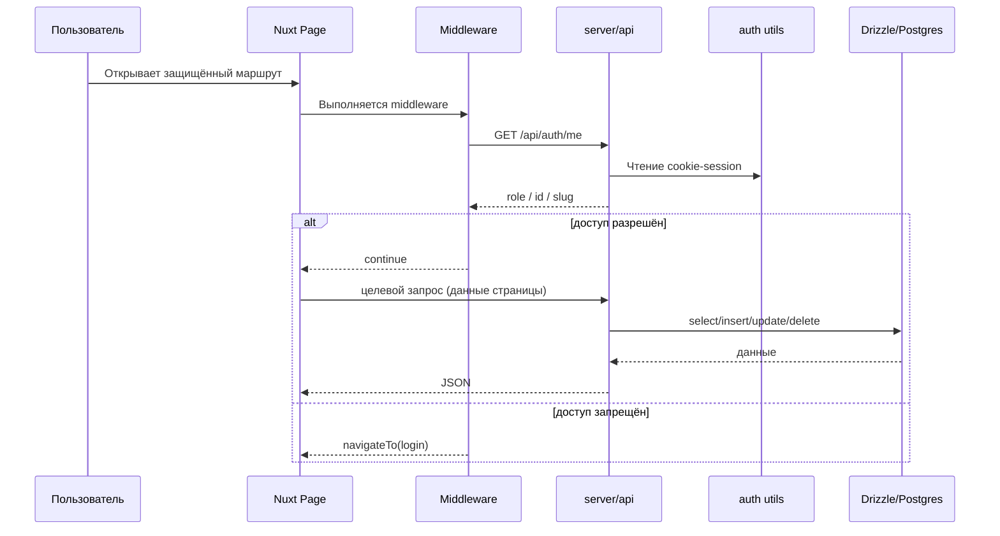

# Архитектура взаимодействия компонентов

## 1) Ключевые подсистемы

- **UI-компоненты** (`app/components/*`) — визуальные блоки страниц.
- **Страницы и layout** (`app/pages/*`, `app/layouts/*`) — маршруты и композиция интерфейса.
- **Middleware** (`app/middleware/*`) — проверка роли на клиентском роутинге.
- **Store** (`app/stores/auth.ts`) — локальное состояние авторизации.
- **API-слой** (`server/api/*`) — бизнес-операции, валидация и доступ к данным.
- **Data layer** (`server/db/*`) — SQL-операции через Drizzle.

## 2) Ролевой контур взаимодействий

В проекте три независимых контра авторизации:

- `admin` (дизайнер),
- `client`,
- `contractor`.

Каждый контур использует собственный cookie-session в `server/utils/auth.ts`:

- `daria_admin_session`,
- `daria_client_session`,
- `daria_contractor_session`.

### Unified проверка сессии

`GET /api/auth/me` возвращает роль текущего пользователя:

- `{ role: 'designer', ... }`,
- `{ role: 'client', projectSlug }`,
- `{ role: 'contractor', contractorId }`,
- `{ role: null }`.

Эти данные используются middleware для редиректов на соответствующие login-страницы.

## 3) Поток запроса: от страницы до БД

## 4) Взаимодействия внутри админского контура

Главный рабочий маршрут: `app/pages/admin/projects/[slug].vue`.

Композиция вкладок:

- `AdminPageContent` — JSON-контент обычных страниц,
- `AdminWorkStatus` — статусы задач,
- `AdminRoadmap` — дорожная карта,
- дополнительные админские компоненты: `AdminMaterials`, `AdminTZ`, `AdminClientProfile` и т.д.

Связанные API:

- `PUT /api/projects/[slug]` — редактирование проекта,
- `POST /api/projects` — создание проекта с выбором `roadmapTemplateKey` и серверной авто-инициализацией структуры,
- `GET/PUT /api/projects/[slug]/page-content` — контент страниц,
- `GET/PUT /api/projects/[slug]/work-status` — задачи,
- `GET/PUT /api/projects/[slug]/roadmap` — этапы.

### Мастер создания проекта

На `app/pages/admin/index.vue` используется 2-шаговый мастер:

1. Ввод данных проекта + выбор шаблона/сценария roadmap.
2. Предпросмотр: основные страницы и этапы roadmap.

После подтверждения сервер создаёт проект с полным базовым набором страниц и стартовыми данными.

### Контур шаблонов и сценариев

Отдельный раздел админки (`/admin/roadmap-templates`) управляет шаблонами:

- `GET /api/roadmap-templates` — список встроенных и пользовательских шаблонов,
- `POST /api/roadmap-templates` — создание пользовательского шаблона,
- `PUT /api/roadmap-templates/[key]` — редактирование пользовательского шаблона,
- `DELETE /api/roadmap-templates/[key]` — удаление пользовательского шаблона.

Встроенные шаблоны защищены от редактирования/удаления, но могут клонироваться в пользовательские.

## 5) Взаимодействия в клиентском контуре

### Витрина проекта

- `app/pages/client/[slug]/index.vue` грузит проект и строит список доступных страниц по `project.pages`.

### Детальная страница

- `app/pages/client/[slug]/[page].vue` выбирает рендер:
  - `ClientRoadmap` для `project_roadmap`,
  - `ClientWorkStatus` для `work_status`,
  - `ClientPageContent` для остальных page-slug.

Клиент имеет права на чтение только своего `projectSlug`.

## 6) Взаимодействия в контуре подрядчика

- `app/pages/contractor/[id]/index.vue`:
  - загружает карточку подрядчика,
  - загружает список его задач (`/api/contractors/[id]/work-items`),
  - отображает только read-only представление.

## 7) API orchestration-уровень

Слой `server/api` выполняет три функции:

1. **Auth guard** (`requireAdmin`, проверка client/contractor session).
2. **Validation** (Zod-схемы для body-параметров).
3. **Persistence** (Drizzle-запросы к таблицам).

Бизнес-логика держится рядом с endpoint, без отдельного сервисного слоя, что делает поток данных прозрачным и коротким.
