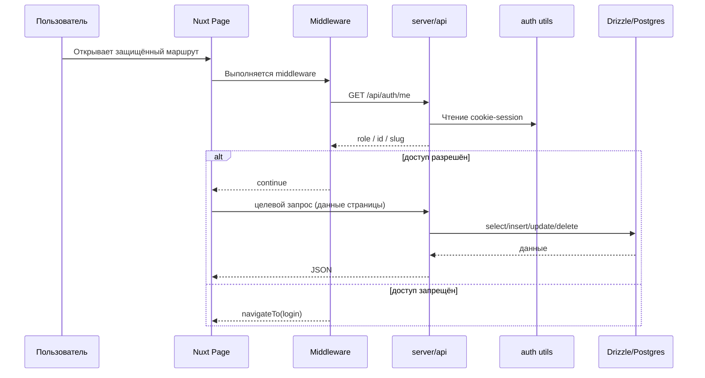

# Архитектура взаимодействия компонентов

> Актуализировано: 2026-04-03. Полный реестр компонентов → [ARCHITECTURE.md](../ARCHITECTURE.md#7-слой-клиента--компоненты)

## 1) Ключевые подсистемы

- **UI-компоненты** (`app/components/*`) — основной слой интерфейса main app.
- **Страницы** (`app/pages/*`) — admin, client, contractor, auth и встроенный chat contour.
- **Layouts** (`app/layouts/*`) — `default`, `admin`, `contractor`.
- **Middleware** (`app/middleware/*`) — `admin`, `client`, `contractor`, `admin-project-canonical`.
- **Composables** (`app/composables/*`) — основной state layer main app через `useState()`.
- **API-слой main app** (`server/api/*`) — Nitro/H3 endpoints, auth и relay helpers.
- **Data layer** (`server/db/*`) — Drizzle ORM для основной платформы.
- **Standalone messaging contours** — встроенный `app/pages/chat/*` + `server/api/chat/*`, а также отдельные `messenger/web`, `messenger/core` и `services/communications-service`.

## 2) Ролевой контур взаимодействий

В основной платформе существуют три session-контура поверх единого auth-flow `/login?role=...`:

- `admin`,
- `client`,
- `contractor`.

Каждый контур использует собственный cookie-session в `server/utils/auth.ts`:

- `daria_admin_session`,
- `daria_client_session`,
- `daria_contractor_session`.

### Unified проверка сессии

`GET /api/auth/me` возвращает роль текущего пользователя:

- `{ role: 'admin', ... }`,
- `{ role: 'client', projectSlug }`,
- `{ role: 'contractor', contractorId }`,
- `{ role: null }`.

Эти данные используются middleware для redirect/canonicalization через alias login pages, которые ведут в unified auth.

Отдельно встроенный chat-контур использует собственную auth-проверку через `GET /api/chat/auth/me` и не смешивается с role-session main app.

## 3) Поток запроса: от страницы до БД

```mermaid
sequenceDiagram
  participant User as Пользователь
  participant Page as Nuxt Page
  participant MW as Middleware
  participant API as server/api
  participant Auth as auth utils
  participant DB as Drizzle/Postgres

  User->>Page: Открывает защищённый маршрут
  Page->>MW: Выполняется middleware
  MW->>API: GET /api/auth/me
  API->>Auth: Чтение cookie-session
  API-->>MW: role / id / slug
  alt доступ разрешён
    MW-->>Page: continue
    Page->>API: целевой запрос (данные страницы)
    API->>DB: select/insert/update/delete
    DB-->>API: данные
    API-->>Page: JSON
  else доступ запрещён
    MW-->>Page: navigateTo(login)
  end
```

## 4) Взаимодействия внутри админского контура

Главный рабочий маршрут: `app/pages/admin/projects/[slug].vue`.

Композиция вкладок:

- `AdminPageContent` — JSON-контент обычных страниц,
- `AdminWorkStatus` — статусы задач,
- `AdminProjectControl` — hybrid project control, coordination и timeline,
- `AdminProjectPhaseBoard` — фазовая сводка и workflow board,
- дополнительные админские компоненты: `AdminMaterials`, `AdminTZ`, `AdminClientProfile` и т.д.

Связанные API:

- `PUT /api/projects/[slug]` — редактирование проекта,
- `POST /api/projects` — создание проекта с серверной авто-инициализацией структуры и стартового project-control payload,
- `GET/PUT /api/projects/[slug]/page-content` — контент страниц,
- `GET/PUT /api/projects/[slug]/work-status` — задачи.

### Мастер создания проекта

На `app/pages/admin/index.vue` используется 2-шаговый мастер:

1. Ввод данных проекта и базовых параметров проекта.
2. Предпросмотр: основные страницы и стартовая phase/project-control структура.

После подтверждения сервер создаёт проект с полным базовым набором страниц и стартовыми данными.

## 5) Взаимодействия в клиентском контуре

### Витрина проекта

- `app/pages/client/[slug]/index.vue` грузит проект и строит список доступных страниц по `project.pages`.
- При ошибке загрузки или истёкшей сессии клиентский shell возвращает пользователя в unified auth `/login?role=client`.

### Детальная страница

- `app/pages/client/[slug]/[page].vue` выбирает рендер:
  - `ClientWorkStatus` для `work_status`,
  - `ClientTimeline` для timeline/project-control представления,
  - `ClientPageContent` для остальных page-slug.

Клиент имеет права на чтение только своего `projectSlug`.

## 6) Взаимодействия в контуре подрядчика

- `app/pages/contractor/[id]/index.vue`:
  - загружает карточку подрядчика,
  - загружает список его задач (`/api/contractors/[id]/work-items`),
  - обновляет собственный профиль через `/api/contractors/[id]/self`,
  - работает с комментариями и фото задач,
  - создаёт и обновляет work items в пределах contractor cabinet.

## 7) API orchestration-уровень

Слой `server/api` выполняет три функции:

1. **Auth guard** (`requireAdmin`, проверка client/contractor session).
2. **Validation** (Zod-схемы для body-параметров).
3. **Persistence** (Drizzle-запросы к таблицам).

Бизнес-логика в main app в основном держится рядом с endpoint, а интеграции с communications relay вынесены в server utils. Standalone messenger и relay service при этом остаются отдельными runtime-контурами вне Nitro API.
