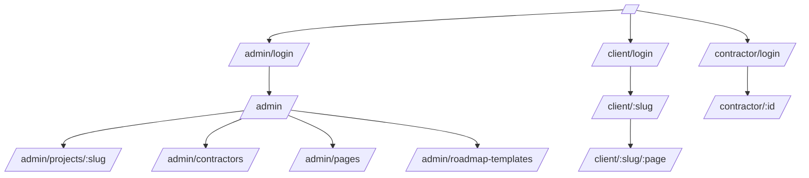

# Структура сайта и маршрутов

## 1) Каркас приложения

Сайт разделён по ролям и layout-ам:

- `default` — публичная зона,
- `admin` — кабинет администратора,
- `cabinet` — кабинет клиента,
- `contractor` — кабинет подрядчика.

## 2) Карта маршрутов

```text
/
├─ /admin/login
├─ /admin
│  ├─ /admin/projects/[slug]
│  ├─ /admin/contractors
│  ├─ /admin/pages
│  └─ /admin/roadmap-templates
├─ /client/login
├─ /client/[slug]
│  └─ /client/[slug]/[page]
├─ /contractor/login
└─ /contractor/[id]
```

## 3) Назначение разделов

### Публичная зона

- `GET /` — стартовая страница (точка входа).

### Админская зона

- `/admin/login` — вход дизайнера по логину/паролю.
- `/admin` — список проектов + мастер создания проекта по шаблону (2 шага: выбор сценария и предпросмотр структуры).
- `/admin/projects/[slug]` — основной workspace проекта:
  - контент страниц,
  - статусы работ,
  - дорожная карта,
  - настройки проекта.
- `/admin/contractors` — реестр подрядчиков.
- `/admin/pages` — конфигурация страниц (порядок, title, display-настройки).
- `/admin/roadmap-templates` — управление шаблонами и сценариями проектов (встроенные + пользовательские).

### Клиентская зона

- `/client/login` — вход клиента по slug проекта.
- `/client/[slug]` — список доступных страниц проекта.
- `/client/[slug]/[page]` — содержимое конкретного раздела.

### Зона подрядчика

- `/contractor/login` — вход по PIN.
- `/contractor/[id]` — профиль подрядчика и назначенные задачи.

## 4) Сопоставление UI-компонентов

### Админ

- `AdminPageContent`
- `AdminWorkStatus`
- `AdminRoadmap`
- `AdminMaterials`
- `AdminTZ`
- `AdminClientProfile`

### Клиент

- `ClientPageContent`
- `ClientWorkStatus`
- `ClientRoadmap`

### Общая логика

- `app/stores/auth.ts` — клиентское состояние сессии.
- `app/middleware/*.ts` — контроль доступа на уровне роутов.

## 5) Навигационная схема



## 6) Правила доступа

- `admin` middleware допускает только `role = designer`.
- `client` middleware допускает только `role = client`.
- `contractor` middleware допускает только `contractorId` в сессии.

Если правило не выполнено — происходит redirect на соответствующую страницу входа.
