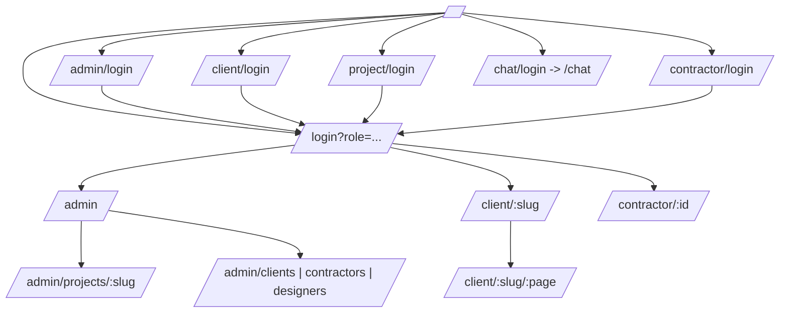

# Структура сайта и маршрутов

> Актуализировано: 2026-04-02. Канонический auth-flow проходит через `/login?role=...`; role-specific login pages сохранены как alias-redirect. Основной справочник → [ARCHITECTURE.md](../ARCHITECTURE.md)

## 1) Контуры продукта

- `app/**` — основная Nuxt-платформа: admin, client, contractor, встроенный chat.
- `messenger/web` + `messenger/core` — standalone messenger с отдельным UI и backend runtime.
- `services/communications-service` — relay/signaling сервис для communications.

## 2) Карта маршрутов основной платформы

```text
/
├─ /login?role=admin|client|contractor
├─ /register?role=admin|client|contractor
├─ /recover?role=admin|client|contractor
├─ /admin/login                    ← alias → /login?role=admin
├─ /client/login                   ← alias → /login?role=client
├─ /project/login                  ← alias → /login?role=client
├─ /contractor/login               ← alias → /login?role=contractor
├─ /admin
│  ├─ /admin/projects/[slug]
│  ├─ /admin/clients
│  ├─ /admin/contractors
│  ├─ /admin/designers
│  ├─ /admin/documents
│  ├─ /admin/pages
│  ├─ /admin/gallery/*
│  └─ /admin/roadmap-templates
├─ /client/[slug]
│  └─ /client/[slug]/[page]
├─ /project/[slug]                 ← alias клиентского project-view
├─ /contractor/[id]
└─ /chat
   ├─ /chat/login
   └─ /chat/register
```

## 3) Назначение разделов

### Public + auth

- `GET /` — landing с переходами в unified auth и legacy alias pages.
- `/login?role=...` — единая страница входа для admin, client, contractor.
- `/register?role=...` — единая регистрация по роли.
- `/recover?role=...` — единое восстановление доступа.
- `/admin/login`, `/client/login`, `/project/login`, `/contractor/login` — страницы обратной совместимости; они сразу редиректят в unified auth-flow.

### Админская зона

- `/admin` — список проектов и dashboard администратора / дизайнера.
- `/admin/projects/[slug]` — основной workspace проекта: управление контентом, фазами, коммуникациями, документами и статусацией.
- `/admin/clients`, `/admin/contractors`, `/admin/designers`, `/admin/documents`, `/admin/pages`, `/admin/gallery/*`, `/admin/roadmap-templates` — реестры, редакторы и справочные контуры админки.

### Клиентская зона

- `/client/[slug]` — кабинет клиента с role-aware middleware.
- `/client/[slug]/[page]` — конкретный раздел проекта.
- `/project/[slug]` — alias клиентского кабинета / project-view.

### Зона подрядчика

- `/contractor/[id]` — кабинет подрядчика: задачи, профиль, документы, бригада.

### Встроенный chat-контур

- `/chat/login`, `/chat/register`, `/chat` — отдельный shell встроенного project communications внутри основной платформы.

## 4) Layouts и middleware

### Layouts

- `default` — public/auth flow, alias login pages и часть role entry routes.
- `admin` — admin shell с util bar, sidebar portal и entity/project навигацией.
- `contractor` — contractor shell.

### Middleware

- `app/middleware/admin.ts` — допускает `admin` и `designer`; при ошибке отправляет на `/admin/login`, который редиректит в `/login?role=admin`.
- `app/middleware/client.ts` — допускает `client`, `admin`, `designer`; для client-session сверяет `projectSlug` с маршрутом.
- `app/middleware/contractor.ts` — допускает `contractor`, `admin`, `designer`; для contractor-session канонизирует собственный `contractorId`.
- `app/middleware/admin-project-canonical.ts` — канонизирует project-view внутри admin-контура.

## 5) Навигационная схема


```mermaid
flowchart TD
  Root[/ /] --> UnifiedLogin[/login?role=.../]
  Root --> AdminAlias[/admin/login/]
  Root --> ClientAlias[/client/login/]
  Root --> ProjectAlias[/project/login/]
  Root --> ContractorAlias[/contractor/login/]

  AdminAlias --> UnifiedLogin
  ClientAlias --> UnifiedLogin
  ProjectAlias --> UnifiedLogin
  ContractorAlias --> UnifiedLogin

  UnifiedLogin --> AdminIndex[/admin/]
  UnifiedLogin --> ClientProject[/client/:slug/]
  UnifiedLogin --> ContractorCabinet[/contractor/:id/]

  AdminIndex --> AdminProject[/admin/projects/:slug/]
  AdminIndex --> AdminRegistry[/admin/clients | contractors | designers/]
  ClientProject --> ClientPage[/client/:slug/:page/]
  Root --> EmbeddedChat[/chat/login -> /chat/]
```

## 6) Правила доступа

- Каноническая точка входа для ролей — `/login?role=admin|client|contractor`.
- Alias login pages сохраняются для обратной совместимости, но не считаются источником истины для auth-flow.
- Admin-preview разрешён как для `admin`, так и для `designer`.
- Client и contractor middleware не noop: они выполняют role-aware проверку сессии и route canonicalization.
