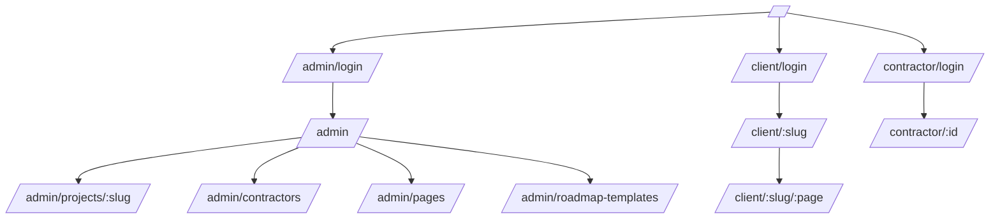

# Структура сайта и маршрутов

> Актуализировано: 2026-03-03. Основной справочник → [ARCHITECTURE.md](../ARCHITECTURE.md)

## 1) Каркас приложения

Сайт разделён по ролям и layout-ам:

- `default` — публичная зона + login-страницы + кабинет клиента,
- `admin` — кабинет администратора (888 строк, полная навигация + UIDesignPanel),
- `contractor` — кабинет подрядчика.

## 2) Карта маршрутов

```text
/
├─ /admin/login
├─ /admin                          ← дашборд проектов
│  ├─ /admin/projects/[slug]       ← workspace проекта (30+ компонентов через pageComponentMap)
│  ├─ /admin/clients               ← CRM клиентов
│  ├─ /admin/contractors            ← реестр подрядчиков + кабинеты
│  ├─ /admin/designers              ← реестр дизайнеров + кабинеты
│  ├─ /admin/documents              ← документы + шаблоны
│  ├─ /admin/pages                  ← настройка страниц
│  ├─ /admin/gallery/furniture      ← галерея мебели
│  ├─ /admin/gallery/materials      ← галерея материалов
│  ├─ /admin/gallery/art            ← галерея арт-объектов
│  ├─ /admin/gallery/interiors      ← галерея интерьеров
│  ├─ /admin/gallery/moodboards     ← галерея мудбордов
│  └─ /admin/roadmap-templates      ← шаблоны roadmap
├─ /client/login
├─ /client/[slug]                   ← кабинет клиента (sidebar + динамические компоненты)
├─ /contractor/login
└─ /contractor/[id]                 ← кабинет подрядчика (профиль, задачи, фото, документы)
```

## 3) Назначение разделов

### Публичная зона

- `GET /` — стартовая страница (точка входа).

### Админская зона

- `/admin/login` — вход дизайнера по логину/паролю.
- `/admin` — список проектов + мастер создания проекта по шаблону (2 шага: выбор сценария и предпросмотр структуры).
- `/admin/projects/[slug]` — основной workspace проекта:
  - контент страниц,
  - статусы работ,
  - дорожная карта,
  - настройки проекта.
- `/admin/contractors` — реестр подрядчиков.
- `/admin/pages` — конфигурация страниц (порядок, title, display-настройки).
- `/admin/roadmap-templates` — управление шаблонами и сценариями проектов (встроенные + пользовательские).

### Клиентская зона

- `/client/login` — вход клиента по slug проекта.
- `/client/[slug]` — список доступных страниц проекта.
- `/client/[slug]/[page]` — содержимое конкретного раздела.

### Зона подрядчика

- `/contractor/login` — вход подрядчика (id + slug).
- `/contractor/[id]` — полный кабинет: профиль, задачи с комментариями/фото, сотрудники, проекты, документы.

## 4) Сопоставление UI-компонентов

### Админ

- `AdminPageContent`
- `AdminWorkStatus`
- `AdminRoadmap`
- `AdminMaterials`
- `AdminTZ`
- `AdminClientProfile`

### Клиент

- `ClientPageContent`
- `ClientWorkStatus`
- `ClientRoadmap`

### Middleware авторизации

- `app/middleware/admin.ts` — проверка admin-сессии → редирект на `/admin/login`.
- `app/middleware/client.ts` — проверка client-сессии + slug проекта → редирект на `/client/login`.
- `app/middleware/contractor.ts` — проверка contractor-сессии → редирект на `/contractor/login`.

## 5) Навигационная схема


```mermaid
flowchart TD
  Root[/ /] --> AdminLogin[/admin/login/]
  Root --> ClientLogin[/client/login/]
  Root --> ContractorLogin[/contractor/login/]

  AdminLogin --> AdminIndex[/admin/]
  AdminIndex --> AdminProject[/admin/projects/:slug/]
  AdminIndex --> AdminContractors[/admin/contractors/]
  AdminIndex --> AdminPages[/admin/pages/]
  AdminIndex --> AdminRoadmapTemplates[/admin/roadmap-templates/]

  ClientLogin --> ClientProject[/client/:slug/]
  ClientProject --> ClientPage[/client/:slug/:page/]

  ContractorLogin --> ContractorCabinet[/contractor/:id/]
```

## 6) Правила доступа

- `admin` middleware допускает только `role = designer`.
- `client` middleware допускает только `role = client`.
- `contractor` middleware допускает только `contractorId` в сессии.

Если правило не выполнено — происходит redirect на соответствующую страницу входа.
