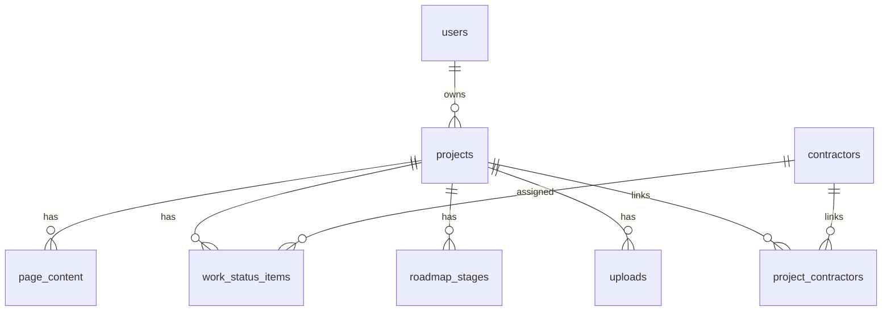

# Архитектура хранения данных

## 1) Обзор модели данных

Основное хранилище — PostgreSQL. Схема описана в `server/db/schema.ts` через Drizzle ORM.

Данные проекта распределены по четырём группам:

1. **Identity/Access** — пользователи и ролевые сессии.
2. **Project Core** — проекты, доступные страницы, профиль проекта.
3. **Execution Data** — контент страниц, статусы задач, дорожная карта.
4. **Reference & Files** — подрядчики, связи проект-подрядчик, загрузки файлов.

## 2) Таблицы и назначение

### `users`

- администраторы/дизайнеры,
- `login`, `email`, `password_hash`, `name`.

### `projects`

- корневая сущность проекта,
- `slug`, `title`, `user_id`, `client_pin`,
- `pages: text[]` — набор активных разделов,
- `profile: jsonb` — произвольные поля проекта.

### `page_configs`

- глобальная конфигурация доступных типов страниц,
- `slug`, `title`, `page_title`, `font_size`, `sort_order`.

### `page_content`

- контент конкретной страницы конкретного проекта,
- уникальность: `(project_id, page_slug)`,
- `content: jsonb`.

### `contractors`

- карточки подрядчиков,
- реквизиты, контакты, `work_types`, `pin`.

### `project_contractors`

- many-to-many связь `projects ↔ contractors`.

### `work_status_items`

- задачи/статусы работ в проекте,
- возможная привязка к подрядчику (`contractor_id` nullable),
- план/факт даты, бюджет, заметки, статус, сортировка.

### `roadmap_stages`

- этапы дорожной карты проекта,
- статус, сроки, описание, сортировка.

### `uploads`

- метаданные загруженных файлов,
- физические файлы лежат в `public/uploads`.

## 3) ER-схема (концептуально)



## 4) Политика целостности

- `projects.slug` — уникальный идентификатор проекта.
- `page_content (project_id, page_slug)` — уникальный контент на страницу.
- `project_contractors (project_id, contractor_id)` — уникальная связка.
- Каскадные удаления:
  - удаление проекта удаляет связанный `page_content`, `work_status_items`, `roadmap_stages`, `project_contractors`, `uploads`.
- Для `work_status_items.contractor_id` используется `ON DELETE SET NULL`.

## 5) Сессии и безопасность данных

Сессии не хранятся в таблицах: используются httpOnly cookies, выставляемые сервером:

- admin-session хранит `userId` (base64 JSON),
- client-session хранит `projectSlug`,
- contractor-session хранит `contractorId`.

Доступ к данным ограничивается и на UI (middleware), и на API-слое (проверки в endpoint).

## 6) Потоки записи данных

### Инициализация нового проекта (создание)

1. Админ запускает мастер создания проекта и выбирает `roadmapTemplateKey`.
2. `POST /api/projects` создаёт запись проекта с полным базовым набором страниц.
3. Сервер автоматически создаёт стартовый контент для ключевых page-slug.
4. Сервер заполняет `roadmap_stages` этапами из выбранного шаблона (или fallback-шаблона).

### Контент страницы

1. Админ отправляет `PUT /api/projects/:slug/page-content`.
2. API ищет проект по `slug`.
3. Upsert в `page_content` по `(project_id, page_slug)`.

### Дорожная карта / статусы работ

1. Админ отправляет массив элементов.
2. API удаляет старые записи по `project_id`.
3. Вставляет новый набор с `sort_order`.

### Загрузка файла

1. Админ отправляет multipart на `/api/upload`.
2. Файл сохраняется в `public/uploads`.
3. URL возвращается клиенту; при необходимости метаданные пишутся в `uploads`.

## 7) Конфигурация и миграции

- Источник схемы: `server/db/schema.ts`.
- Генерация/применение миграций: `drizzle-kit` (`db:generate`, `db:migrate`, `db:push`).
- Конфиг Drizzle: `drizzle.config.ts`.

## 8) Типовые справочники (catalogs)

Единый набор типов вынесен в `shared/types/catalogs.ts` и используется для выбора в админке.

### Базовые типы

- `roadmapStageType` — тип этапа дорожной карты.
- `clientType` — тип клиента.
- `materialType` — тип материалов.
- `contractorType` — тип подрядчика.
- `contractorRoleTypes[]` — роли подрядчиков.
- `contractorWorkTypes[]` — типы работ подрядчиков.
- `designerServiceTypes[]` — типы услуг дизайнера.
- `paymentType` — тип оплаты.
- `contractType` — тип договора.
- `roadmapComplexity` — сложность дорожной карты.

### Дополнительно (расширенный список)

- `projectPriority` — приоритет проекта.
- `objectType` — тип объекта.

### Пример заполненного объекта профиля проекта

```json
{
  "clientType": "family",
  "objectType": "apartment",
  "projectPriority": "high",
  "roadmapType": "implementation",
  "roadmapComplexity": "advanced",
  "materialType": "finishing_materials",
  "contractorType": "ooo",
  "contractorRoleTypes": ["electrician", "plumber", "foreman"],
  "contractorWorkTypes": ["electrical_installation", "puttying", "plumbing_installation"],
  "designerServiceTypes": ["technical_task", "visualization_3d", "author_supervision"],
  "paymentType": "sbp",
  "contractType": "milestone_based"
}
```

### Пример заполненного объекта подрядчика

```json
{
  "name": "ООО Пример Строй",
  "slug": "primer-stroy",
  "workTypes": ["puttying", "electrical_installation", "plumbing_installation"],
  "pin": "4321"
}
```

## 9) Готовые шаблоны дорожных карт

В админке доступны преднастроенные сценарии в `shared/types/roadmap-templates.ts`.

Пользовательские шаблоны хранятся отдельно в файле:

- `server/data/roadmap-templates.custom.json`

Сервер объединяет встроенные и пользовательские шаблоны в единый каталог через `server/utils/roadmap-templates.ts`.

### Категории и покрытие сценариев

Каталог включает расширенное покрытие по профильной практике:

- жилые объекты: квартиры, дома,
- коммерция: офис, ритейл, HoReCa,
- общественные пространства,
- типы клиентов: физлицо, юрлицо, семья, инвестор, девелопер,
- уровни сложности: базовый, стандарт, advanced, premium.

### Примеры шаблонов

- `Квартира · Физлицо · Базовый`
- `Квартира · Семья · Стандарт`
- `Дом · Физлицо · Повышенная сложность`
- `Офис · Юрлицо · Стандарт`
- `Ритейл · Юрлицо · Базовый/быстрый`
- `HoReCa · Инвестор · Премиум`
- `Квартира (show-unit) · Девелопер · Премиум`
- `Офис (штаб-квартира) · Девелопер · Повышенная сложность`
- `Общественное пространство · Девелопер · Повышенная сложность`

Шаблон включает:

- мета-атрибуты (`objectType`, `clientType`, `complexity`),
- набор этапов с `stageKey`, названием и описанием,
- готовую последовательность для быстрого старта проекта.

Применение шаблона выполняется в UI `AdminRoadmap` с возможностью дальнейшего редактирования этапов.

Создание и поддержка пользовательских сценариев выполняется в разделе `/admin/roadmap-templates` через API CRUD.
