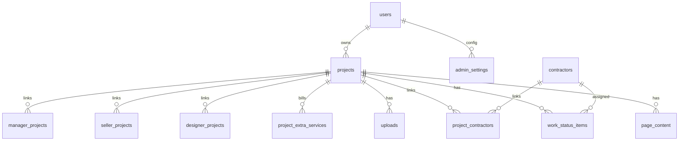

# Архитектура хранения данных

> Актуализировано: 2026-04-03. Полный список таблиц и ER-диаграмма → [ARCHITECTURE.md](../ARCHITECTURE.md#2-слой-данных---база-данных)

## 1) Обзор модели данных

Основное хранилище — PostgreSQL 16 (Docker, порт 5433). Схема описана в `server/db/schema.ts` через Drizzle ORM.

Эта схема покрывает **основную платформу**. Standalone messenger (`messenger/core`) и `services/communications-service` используют отдельные storage-контракты и не описываются этим файлом.

**24 таблицы** распределены по нескольким группам:

1. **System / Access** — `users`, `admin_settings`.
2. **Project Core** — `projects`, `page_configs`, `page_content`, `clients`.
3. **Execution / Delivery** — `work_status_items`, `work_status_item_photos`, `work_status_item_comments`.
4. **Project economics / docs** — `documents`, `project_extra_services`, `uploads`, `gallery_items`.
5. **Contractors** — `contractors`, `project_contractors`, `contractor_documents`.
6. **Designers** — `designers`, `designer_projects`, `designer_project_clients`, `designer_project_contractors`.
7. **Sellers** — `sellers`, `seller_projects`.
8. **Managers** — `managers`, `manager_projects`.

## 2) Таблицы и назначение

### `users`

- администраторы,
- `login`, `email`, `password_hash`, `name`.

### `admin_settings`

- key-value storage для admin-level JSON-настроек,
- используется в том числе для token/config данных админского контура.

### `projects`

- корневая сущность проекта,
- `slug`, `title`, `status`, `project_type`, `user_id`,
- `client_login`, `client_password_hash`, `client_recovery_phrase_hash`,
- `pages: text[]` — набор активных разделов,
- `profile: jsonb` — произвольные поля проекта.

### `page_configs`

- глобальная конфигурация доступных типов страниц,
- `slug`, `title`, `page_title`, `font_size`, `sort_order`.

### `page_content`

- контент конкретной страницы конкретного проекта,
- уникальность: `(project_id, page_slug)`,
- `content: jsonb`.

### `contractors`

- карточки подрядчиков,
- реквизиты, контакты, `work_types`, `role_types`, auth-поля и расширенные паспортные/финансовые данные.

### `project_extra_services`

- дополнительные услуги по проекту,
- статусы, суммы, quantity/unit и связи с договором/инвойсом.

### `designers`, `designer_projects`, `designer_project_clients`, `designer_project_contractors`

- отдельный контур дизайнерских кабинетов, услуг, пакетов и связок с проектами/клиентами/подрядчиками.

### `sellers`, `seller_projects`

- поставщики и их привязки к проектам.

### `managers`, `manager_projects`

- менеджеры и их участие в проектах.

### `project_contractors`

- many-to-many связь `projects ↔ contractors`.

### `work_status_items`

- задачи/статусы работ в проекте,
- возможная привязка к подрядчику (`contractor_id` nullable),
- план/факт даты, бюджет, заметки, статус, сортировка.

### `uploads`

- метаданные загруженных файлов,
- физические файлы лежат в `public/uploads`.

### Roadmap и stage model

- отдельной таблицы `roadmap_stages` в текущей схеме нет,
- фазовая и project-control структура проекта формируется через page/shared contracts и bootstrap-логику создания проекта,
- статусы и фазовая навигация живут в shared contracts и UI/server orchestration, а не в dedicated DB table.

## 3) ER-схема (концептуально)


```mermaid
erDiagram
  users ||--o{ projects : owns
  users ||--o{ admin_settings : config
  projects ||--o{ page_content : has
  projects ||--o{ work_status_items : has
  projects ||--o{ uploads : has
  projects ||--o{ project_contractors : links
  projects ||--o{ project_extra_services : bills
  projects ||--o{ designer_projects : links
  projects ||--o{ seller_projects : links
  projects ||--o{ manager_projects : links
  contractors ||--o{ project_contractors : links
  contractors ||--o{ work_status_items : assigned
```

## 4) Политика целостности

- `projects.slug` — уникальный идентификатор проекта.
- `page_content (project_id, page_slug)` — уникальный контент на страницу.
- `project_contractors (project_id, contractor_id)` — уникальная связка.
- Каскадные удаления:
  - удаление проекта удаляет связанный `page_content`, `work_status_items`, `project_contractors`, `uploads`, `project_extra_services` и linking tables по каскадным связям.
- Для `work_status_items.contractor_id` используется `ON DELETE SET NULL`.

## 5) Сессии и безопасность данных

Сессии не хранятся в таблицах: используются **HMAC-подписанные httpOnly cookies** (SHA-256, 30 дней):

- `daria_admin_session` — хранит `userId`,
- `daria_client_session` — хранит `projectSlug`,
- `daria_contractor_session` — хранит `contractorId`.

Доступ к данным ограничивается и на UI (middleware), и на API-слое (`requireAdmin()`, `requireAdminOrClient()`, `requireAdminOrContractor()`).

## 6) Потоки записи данных

### Инициализация нового проекта (создание)

1. Админ запускает мастер создания проекта и задаёт базовые параметры проекта.
2. `POST /api/projects` создаёт запись проекта с полным базовым набором страниц.
3. Сервер автоматически создаёт стартовый контент для ключевых page-slug.
4. Сервер инициализирует project pages и связанную bootstrap-структуру phase/project-control из shared contracts и project defaults.

### Контент страницы

1. Админ отправляет `PUT /api/projects/:slug/page-content`.
2. API ищет проект по `slug`.
3. Upsert в `page_content` по `(project_id, page_slug)`.

### Статусы работ

1. Админ отправляет массив элементов.
2. API удаляет старые записи по `project_id`.
3. Вставляет новый набор с `sort_order`.

### Загрузка файла

1. Админ отправляет multipart на `/api/upload`.
2. Файл сохраняется в `public/uploads`.
3. URL возвращается клиенту; при необходимости метаданные пишутся в `uploads`.

## 7) Конфигурация и миграции

- Источник схемы: `server/db/schema.ts`.
- Генерация/применение миграций: `drizzle-kit` (`db:generate`, `db:migrate`, `db:push`).
- Конфиг Drizzle: `drizzle.config.ts`.

## 8) Типовые справочники (catalogs)

Единый набор типов вынесен в `shared/types/catalogs.ts` и используется для выбора в админке.

### Базовые типы

- `projectStatus` / `PROJECT_PHASES` — канонические фазы жизненного цикла проекта.
- `clientType` — тип клиента.
- `materialType` — тип материалов.
- `contractorType` — тип подрядчика.
- `contractorRoleTypes[]` — роли подрядчиков.
- `contractorWorkTypes[]` — типы работ подрядчиков.
- `designerServiceTypes[]` — типы услуг дизайнера.
- `paymentType` — тип оплаты.
- `contractType` — тип договора.
- `projectPriority` — приоритет проекта.
- `objectType` — тип объекта.

### Дополнительно (расширенный список)

- `workTypeStages` — шаги и стадии подрядных работ.
- `*_OPTIONS` — нормализованные option arrays для UI-форм.

### Пример заполненного объекта профиля проекта

```json
{
  "clientType": "family",
  "objectType": "apartment",
  "projectPriority": "high",
  "materialType": "finishing_materials",
  "contractorType": "ooo",
  "contractorRoleTypes": ["electrician", "plumber", "foreman"],
  "contractorWorkTypes": ["electrical_installation", "puttying", "plumbing_installation"],
  "designerServiceTypes": ["technical_task", "visualization_3d", "author_supervision"],
  "paymentType": "sbp",
  "contractType": "milestone_based"
}
```

### Пример заполненного объекта подрядчика

```json
{
  "name": "ООО Пример Строй",
  "slug": "primer-stroy",
  "login": "primer-stroy",
  "workTypes": ["puttying", "electrical_installation", "plumbing_installation"],
  "telegram": "@primerstroy"
}
```

## 9) Phase / Project Control bootstrap

Отдельного runtime-контура шаблонов фаз в текущей кодовой базе нет.

Стартовая фазовая структура проекта собирается из нескольких источников:

- `shared/types/catalogs.ts` — канонические project statuses, object/client/payment/contract catalogs,
- `shared/types/phase-steps.ts` — бизнес- и IT-описания шагов по фазам,
- `shared/constants/pages.ts` — состав страниц и phase labels,
- `shared/utils/project-control.ts` — bootstrap и orchestration helper-ы hybrid control,
- `shared/utils/project-control-timeline.ts` — timeline/date helpers для phase/project-control UI.

То есть фазовый каркас проекта формируется не через отдельный CRUD шаблонов, а через shared contracts и серверную инициализацию проекта.
